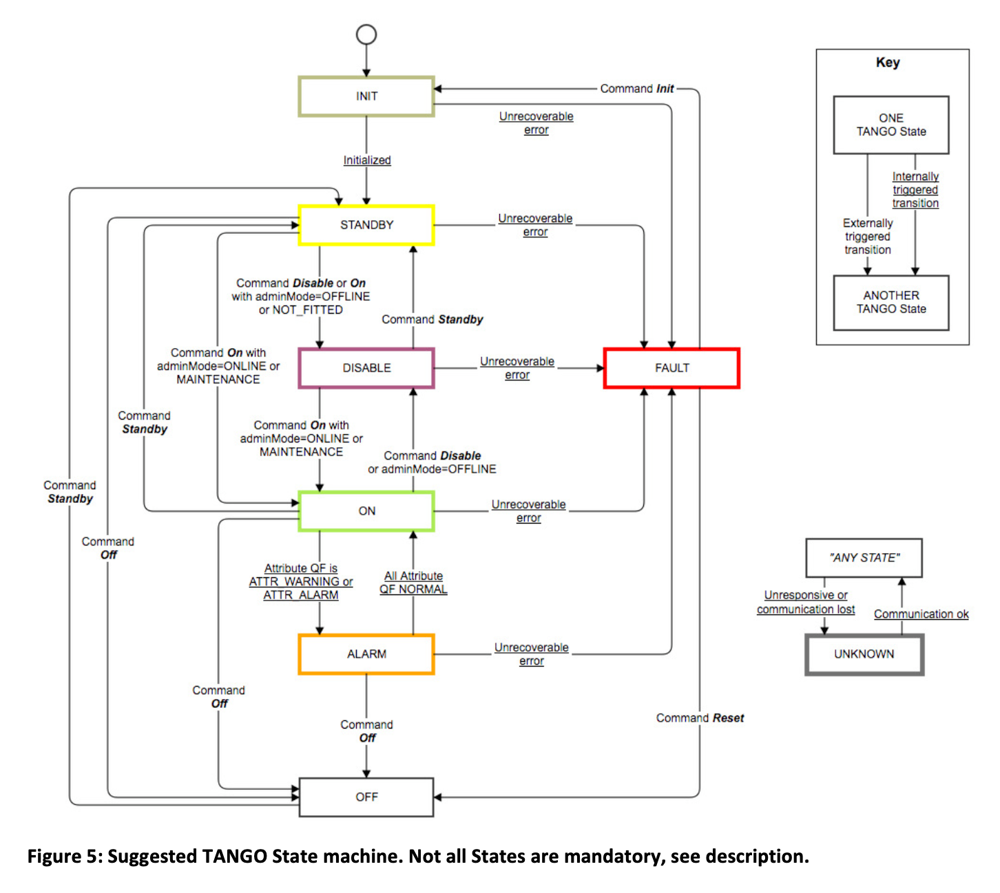
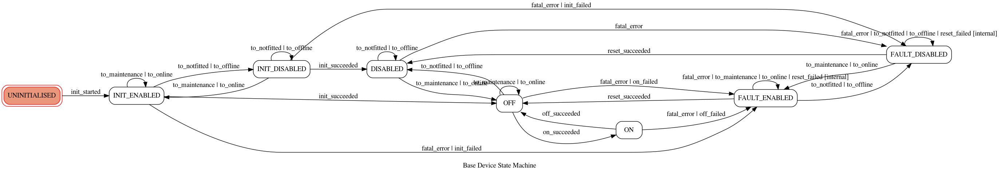
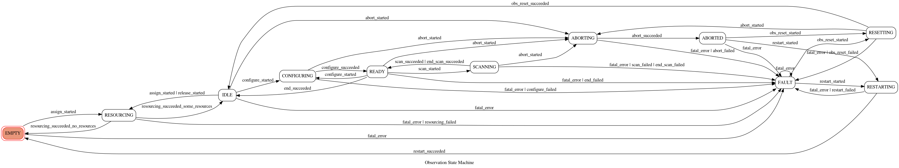

State Machine
=============

The state machine modules implements SKA's two fundamental state machines: the
base device state machine, and the observation state machine.

Base device state machine
-------------------------
The base device state machine provides basic state needed for all devices,
covering initialisation, off and on states, and a fault state. This state
machine is implemented by all SKA Tango devices that inherit from these LMC
base classes, though some devices with standby power modes may need to
implement further states.

        documentation, showing the state machine as designed

  Diagram of the device state machine, taken from SKA design
  documentation, showing the state machine as designed

        from the state machine as specified in code.

  Diagram of the device state machine, automatically generated from the
  state machine as specified in code. The equivalence of this diagram to
  the diagram previous demonstrates that the machine has been
  implemented as designed.

Observation state machine
-------------------------
The observation state machine is implemented by devices that manage
observations (currently only subarray devices).

.. figure:: images/ADR-8.png
  :width: 80%
  :alt: Diagram of the observation state machine, as decided and published in ADR-8.
  
  Diagram of the observation state machine, as decided and published in ADR-8.

        the state machine as specified in code.
  
  Diagram of the observation state machine, automatically generated from
  the state machine as specified in code. The equivalance of this
  diagram to the diagram previous demonstrates that the machine has been
  implemented in conformance with ADR-8.

API
---

.. toctree::
   :maxdepth: 2

.. automodule:: ska.base.state_machine
    :members:
    :undoc-members:

