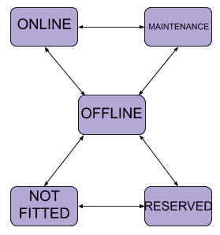
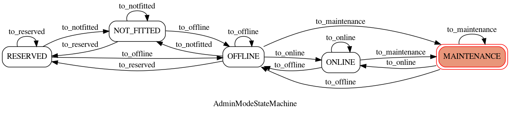
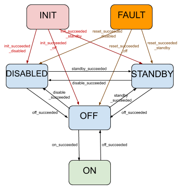
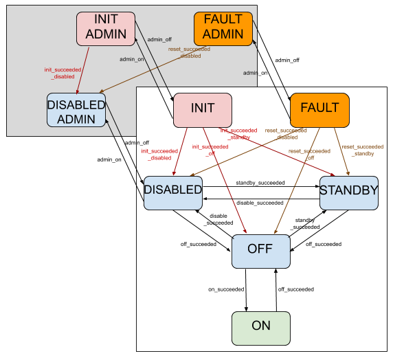
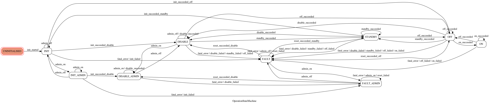
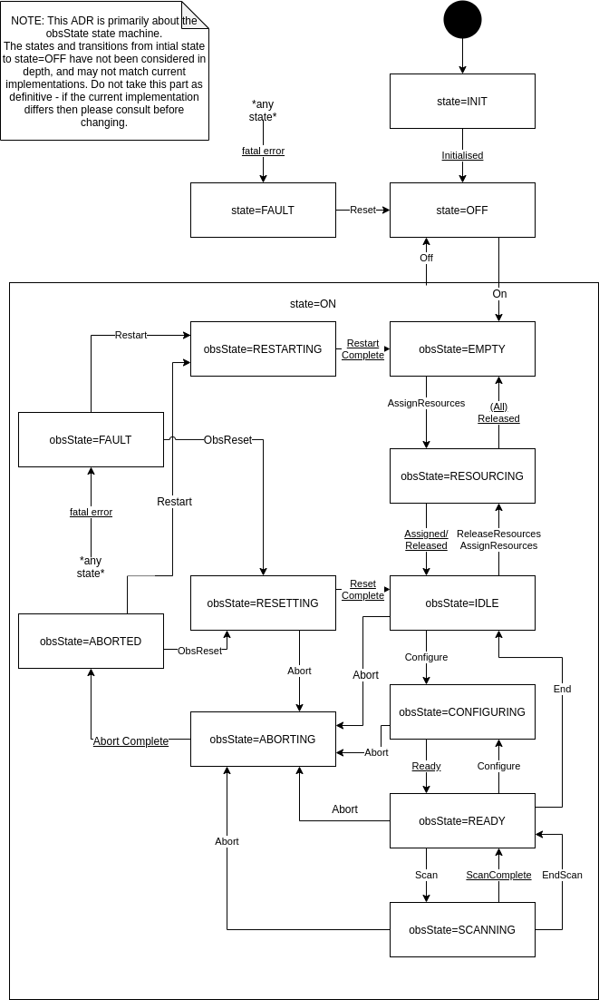
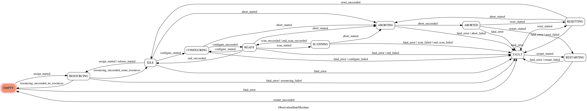

State Machine
=============

The state machine module implements three fundamental SKA state
machines:

* the admin mode state machine
* the operational state (opState, represented in TANGO devices by TANGO
  state) state machine
* the observation state machine.

Admin mode state machine
------------------------
The admin mode state machine allows for transitions between the five
administrative modes:

* NOT_FITTED: this is the lowest state of readiness, representing
  devices that cannot be deployed without some external action, such as
  plugging hardware in or updating network settings.)
* RESERVED: the device is fitted but redundant to other devices. It is
  ready to take over should other devices fail.
* OFFLINE: the device has been declared by SKA operations not currently
  to be used for operations (or whatever other function it provides)
* MAINTENANCE: the device cannot be used for science purposes but can be
  operationed for engineering / maintenance purposes, such as testing,
  debugging, etc
* ONLINE: the device can be used for science purposes.

The admin mode state machine allows for

* any transition between the modes NOT_FITTED, RESERVED and OFFLINE
  (e.g. an unfitted device being fitted as a redundant or non-redundant
  device, a redundant device taking over when another device fails, etc)
* any transition between the modes OFFLINE, MAINTENANCE and ONLINE (e.g.
  an online device being taken offline or put into maintenance mode to
  diagnose a fault, a faulty device moving between maintenance and
  offline mode as it undergoes sporadic periods of diagnosis.

Diagrams of the admin mode state machine are shown below.

  Diagram of the admin mode state machine, as designed

  Diagram of the admin mode state machine, automatically generated from
  the implementation. The equivalence of this diagram to the diagram
  above demonstrates that the machine has been implemented as designed.

Operational state state machine
-------------------------------
The operational state (opState) machine represents the operational state
of a SKA device. It is represented in TANGO devices using the TANGO
"state", so the states used are a subset of the TANGO states: INIT,
FAULT, DISABLE, STANDBY, OFF and ON.

* INIT: the device is currently initialising
* FAULT: the device has experienced an error from which it could not
  recover.
* DISABLE: the device is in its lowest state of readiness, from which
  it may take some time to become fully operational. For example, if the
  device manages hardware, that hardware may be switched off.
* STANDBY: the device is unready, but can be made ready quickly. For
  example, if the device manages hardware, that hardware may be in a
  low-power standby mode.
* OFF: the device is fully operational but is not currently in use
* ON: the device is in use

The operational state state machine allows for:

* transition from INIT or FAULT into any of the three "readiness states"
  DISABLE, STANDBY and OFF.
* all transitions between these three "readiness states" DISABLE,
  STANDBY and OFF.
* transition between OFF and ON.

        ignoring coupling with admin mode

  Diagram of the operational state (opState) state machine, as
  designed, ignoring coupling with admin mode

Unfortunately, operational state is inextricably coupled with admin
mode: there are admin modes that imply disablement, and operational
states such as ON should not be possible in such admin modes.

To facilitate this, the entire operational state state machine is
accessible only when the admin mode is ONLINE or MAINTENANCE. When in
any other admin mode, the only permitted operational states are INIT,
FAULT and DISABLE. This constraint is implemented into the operational
state state machine by

* three extra states: INIT_ADMIN, FAULT_ADMIN and DISABLED_ADMIN
* two extra transition triggers: "admin_on" and "admin_off", which allow
  for transition between INIT and INIT_ADMIN; FAULT and FAULT_ADMIN; and
  DISABLE and DISABLE_ADMIN. 

This implementation minimises the coupling between admin mode and
operational state, allowing the two machines to be conceptualised almost
separately.

Diagrams of the operational state state machine are shown below.

        showing coupling with admin mode

  Diagram of the operational state (opState) state machine, as
  designed, showing coupling with admin mode

  Diagram of the operational state state machine, automatically
  generated from the implementation. The equivalence of this diagram
  to the diagram above demonstrates that the machine has been
  implemented as designed.

Observation state machine
-------------------------
The observation state machine is implemented by devices that manage
observations (currently only subarray devices).

        published in ADR-8.
  
  Diagram of the observation state machine, as decided and published in
  ADR-8.

        generated from the implementation
  
  Diagram of the observation state machine, automatically generated from
  the implementation. The equivalance of this diagram to the diagram
  previous demonstrates that the machine has been implemented in
  conformance with ADR-8.

API
---

.. automodule:: ska.base.state_machine
    :members:
    :undoc-members:

.. autoclass:: OperationStateMachine
    :members:

.. autoclass:: AdminModeStateMachine
    :members:

.. autoclass:: ObservationStateMachine
    :members:
