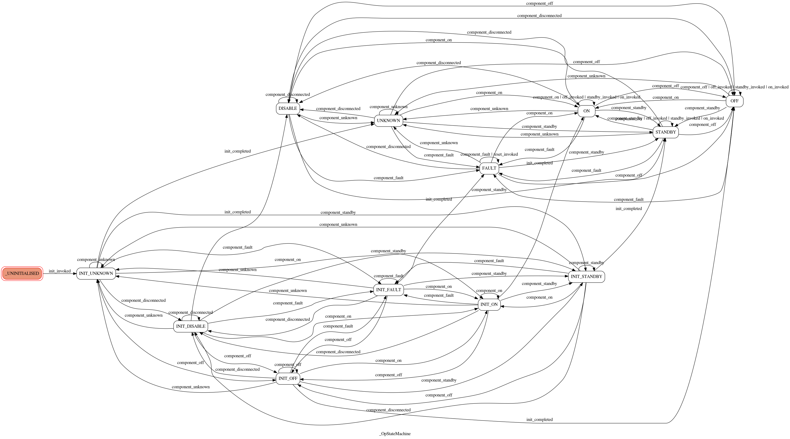

Operational state ("op state") model
====================================

.. toctree::
   :maxdepth: 2

The operational state model consists of a public model class that drives
an underlying state machine. The API of the model class is documented
below. The underlying state machine is a private class, so the API is
not documented here, but will be briefly described.

State machine
-------------
The underlying state machine provides the sames states as the model,
except that there are additional initialisation states to account for
component state. For example, an initialising device whose underlying
component is turned on will be in state "INIT_ON". These extra states
ensure that the state machine is deterministic. The model collapses all
these  initialisation states into a single INIT state.

A diagram of the state machine is shown below. Essentially, the
machine has three "super-states", representing a device before,
during and after initialisation. Transition between these
"super-states" is triggered by the "init_invoked" and
"init_completed" actions. In the last two "super-states", the device
monitors the component and updates its state accordingly.

.. uml:: diagrams/op_state_machine.uml
  :caption: Diagram of the op state machine

The following is an diagram of the state machine, automatically
generated from the code. Its equivalence to the diagram above
demonstrates that the implementation is faithful to the design.

API
---

ska_tango_base.state.op_state_model module
^^^^^^^^^^^^^^^^^^^^^^^^^^^^^^^^^^^^^^^^^^
.. automodule:: ska_tango_base.state.op_state_model
   :special-members: __init__
   :members:
   :undoc-members:
