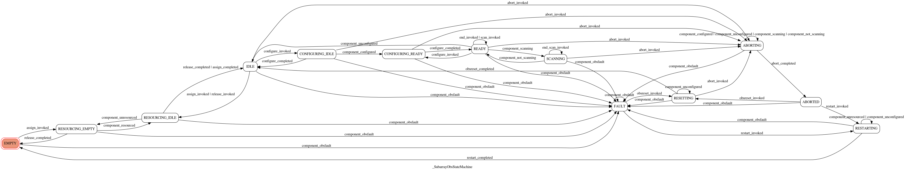

Subarray observation state model
================================

.. toctree::
  :maxdepth: 2

The subarray observation state model consists of a public model class
that drives an underlying state machine. The API of the model class is
documented below. The underlying state machine is a private class, so
the API is not documented here, but will be briefly described.
  
Subarray state machine
----------------------
The underlying state machine is essentially as agreed in ADR-8, but with
some states broken down into sub-states to account for the interactions
between commands and monitoring of the underlying component.

For example, ADR-8 says that a configuring subarray moves from IDLE to
CONFIGURING to READY. But in a device model where the state machine is
responsive to both commands and changes to the monitored component, the
sequence is better represented as follows:

1. The Configure() command triggers the "configure_invoked" action on
   the state machine, resulting in a transition from IDLE to
   CONFIGURING_IDLE
2. The Configure() command invokes methods on its component in order to
   effect configuration. At some point in this process, the component
   triggers the "component_configured" action on the state machine,
   resulting in a transition from CONFIGURING_IDLE to CONFIGURING_READY.
3. At completion of configuration, the action "configure_completed" is
   triggered on the state machine, resulting in a transition from
   CONFIGURING_READY to READY.

Thus, this machine contains substates CONFIGURING_IDLE and
CONFIGURING_READY, rather than the ADR-8 state CONFIGURING.

A diagram of the state machine is shown below.

.. uml:: diagrams/subarray_obs_state_machine.uml
  :caption: Diagram of the subarray obs state machine

The following is a diagram of the state machine, automatically
generated from the code. Its equivalence to the diagram above
demonstrates that the implementation is faithful to the design.

API
---

ska_tango_base.state.subarray_obs_state_model module
^^^^^^^^^^^^^^^^^^^^^^^^^^^^^^^^^^^^^^^^^^^^^^^^^^^^

.. automodule:: ska_tango_base.state.subarray_obs_state_model
   :special-members: __init__
   :members:
   :undoc-members:
  